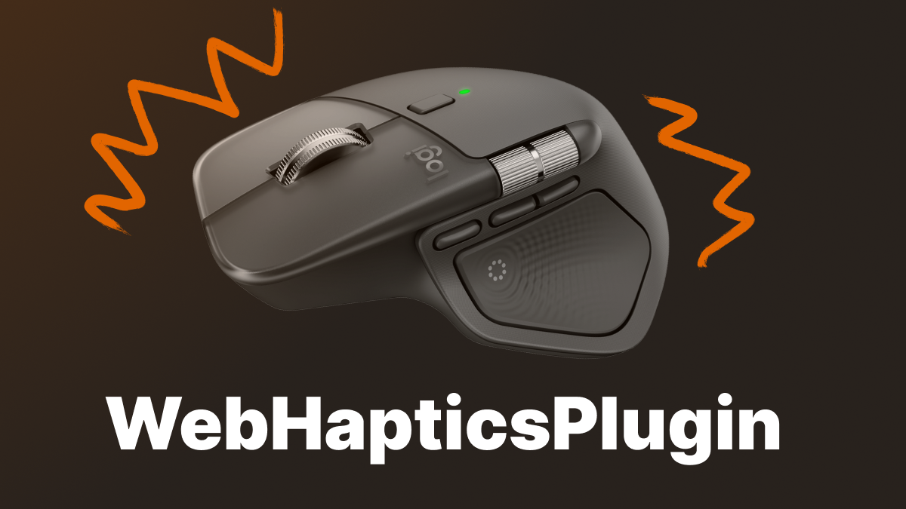

<h1 align="center">
  <br>
  <a href="https://haptics.jmw.nz" target="_blank">
    
  </a>
</h1>


A Logi Actions SDK plugin that exposes MX Master 4 haptic feedback via a local HTTPS server and WebSocket API.

## Requirements

- Logitech MX Master 4 mouse
- Logi Options+ installed
- Logi Plugin Service running

## API Server

The plugin runs an HTTPS server on `https://local.jmw.nz:41443/` when loaded.

### About local.jmw.nz

`local.jmw.nz` resolves to `127.0.0.1`. The plugin uses this domain to serve HTTPS with a valid SSL certificate instead of self-signed certs that browsers reject. The certificate is automatically downloaded from GitHub, cached locally, and refreshed every 24 hours.

### REST API Endpoints

| Endpoint | Method | Description |
|----------|--------|-------------|
| `/` | GET | Health check with service info and available endpoints |
| `/waveforms` | GET | List all 15 available haptic waveforms |
| `/haptic/{waveform}` | POST | Trigger a specific haptic waveform |

### WebSocket API

**Endpoint:** `wss://local.jmw.nz:41443/ws`

Keeps a warm connection for theoritically lower latency.

**Protocol:**
- Send a single byte containing the waveform index (0-14)
- No response is sent back
- Connection stays open for repeated triggers

### Available Waveforms

The plugin supports 15 haptic waveforms across different categories:

| Waveform | Index | Category |
|----------|-------|----------|
| `sharp_collision` | 0 | Precision enhancers |
| `sharp_state_change` | 1 | Progress indicators |
| `knock` | 2 | Incoming events |
| `damp_collision` | 3 | Precision enhancers |
| `mad` | 4 | Progress indicators |
| `ringing` | 5 | Incoming events |
| `subtle_collision` | 6 | Precision enhancers |
| `completed` | 7 | Progress indicators |
| `jingle` | 8 | Incoming events |
| `damp_state_change` | 9 | Precision enhancers |
| `firework` | 10 | Progress indicators |
| `happy_alert` | 11 | Progress indicators |
| `wave` | 12 | Progress indicators |
| `angry_alert` | 13 | Progress indicators |
| `square` | 14 | Progress indicators |

## Example Usage

### HTTP REST API

```bash
# Health check
curl https://local.jmw.nz:41443/

# List all available waveforms
curl https://local.jmw.nz:41443/waveforms

# Trigger haptic feedback (note: -d '' is required to send Content-Length header)
curl -X POST -d '' https://local.jmw.nz:41443/haptic/sharp_collision
curl -X POST -d '' https://local.jmw.nz:41443/haptic/happy_alert
curl -X POST -d '' https://local.jmw.nz:41443/haptic/completed
# {
#   "success": true,
#   "waveform": "completed"
# }

```

> **Note:** POST requests require a `Content-Length` header. When using curl, include `-d ''` to send an empty body with the proper header otherwise the request will hang. I have some *thoughts* about this design choice by the otherwise great NetCoreServer library.

### WebSocket API (JavaScript)

```javascript
// Connect to WebSocket
const ws = new WebSocket('wss://local.jmw.nz:41443/ws');

ws.onopen = () => {
  console.log('Connected to HapticWeb');
  
  // Trigger "sharp_collision" (index 0)
  ws.send(new Uint8Array([0]));
  
  // Trigger "completed" (index 7)
  ws.send(new Uint8Array([7]));
  
  // Trigger "happy_alert" (index 11)
  ws.send(new Uint8Array([11]));
};

ws.onclose = () => console.log('Disconnected');
ws.onerror = (err) => console.error('WebSocket error:', err);
```


## Technical Details

### Architecture
- **Server:** NetCoreServer-based HTTPS/WSS
- **Port:** 41443 (HTTPS only)
- **Certificate:** Auto-managed from GitHub
- **CORS:** Enabled, any origin
- **Binding:** `127.0.0.1` only

### Certificate Management
- Downloads from the GitHub `certs` branch on first run
- Cached locally in plugin data directory
- Refreshes every 24 hours
- Warns 14 days before expiry
- Falls back to cache if GitHub is unreachable

## Manual Installation

1. Open Logitech Options+ and click on your MX Master 4.
2. In the left sidebar, open the `HAPTIC FEEDBACK` tab and click on the haptic feedback settings popover.
3. In the new right sidebar, click the `INSTALL AND UNINSTALL PLUGINS` button. Now you're in the plugin management window.
4. Download the `HapticWeb.lplug4` release asset from [GitHub Releases](https://github.com/fallstop/HapticWebPlugin/releases) and double-click it.
5. This will trigger an installation dialog in Logitech Options+. Press continue.
6. The server starts automatically at `https://local.jmw.nz:41443/`
7. Test at [https://haptics.jmw.nz](https://haptics.jmw.nz)

### Uninstalling
A manually installed plugin doesn't show in the plugin list, so to uninstall, simply delete the plugin folder:

```bash
# Windows
C:\Users\USERNAME\AppData\Local\Logi\LogiPluginService\Plugins\HapticWebPlugin\

# macOS
~/Library/Application Support/Logi/LogiPluginService/Plugins/HapticWebPlugin/
```

## Development

### Building
```bash
# Debug build (auto-reloads in Logi Plugin Service)
dotnet build -c Debug

# Release build
dotnet build -c Release
```

### Packaging & Distribution
```bash
# Create plugin package
logiplugintool pack ./bin/Release ./HapticWeb.lplug4

# Install locally
logiplugintool install ./HapticWeb.lplug4

# Uninstall
logiplugintool uninstall HapticWeb
```

### Testing
- **Manual testing:** Use the demo site at [https://haptics.jmw.nz](https://haptics.jmw.nz)
- **CLI testing:** Use curl commands shown in [Example Usage](#example-usage)
- **Live reload:** Debug builds auto-reload when the plugin is rebuilt

## Troubleshooting

### Certificate Issues
If you see certificate errors:
1. Check plugin status in Logi Options+ (should show green "Normal")
2. Verify internet connection (initial certificate download requires network)
3. Restart Logi Plugin Service
4. Report an issue with the plugin logs if the problem persists

### Port Already in Use
If port 41443 is in use:
1. Stop other services using the port: `lsof -ti:41443 | xargs kill -9` (macOS/Linux)
2. Restart Logi Plugin Service

### WebSocket Connection Failed
If WebSocket connections fail:
1. Verify the server is running: `curl https://local.jmw.nz:41443/`
2. Check browser console for errors
3. Ensure you're using `wss://` (not `ws://`)
4. Verify `local.jmw.nz` resolves to `127.0.0.1`: `ping local.jmw.nz`

## MIT License

See [LICENSE.md](LICENSE.md) for details.